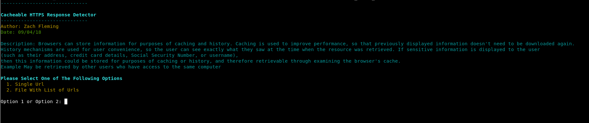

# Cacheable HTTPS Response

### Description

Tool to check if a target site handles https cache control effectively or if it is vulnerable to cacheable https attacks.

### What Is A Cacheable HTTPS Attack

Browsers can store information for purposes of caching and history. Caching is used to improve performance, so that previously displayed information doesn't need to be downloaded again. History mechanisms are used for user convenience, so the user can see exactly what they saw at the time when the resource was retrieved. If sensitive information is displayed to the user (such as their address, credit card details, Social Security Number, or username), then this information could be stored for purposes of caching or history, and therefore retrievable through examining the browser's cache. Example: Information may be retrieved by other users who have access to the same computer

### Launching the program

To use the program simply open up a terminal and run it with "python cacheable_https_response.py"

### How To / Program Features

The program has two options. It can either can a single url, or a list of target urls. 
To scan a single url you must include the full url and port number. For example https://www.samplesite.com:443
To scan a text file containg urls, the file must be formatted as follows. Each url must be on a new line and with the following format https://www.samplesite.com:443. A sample text file ahs been included also. 

The logic behind the porgram is that it will connect to a given url and check the repsone headers to see if they contain the cache-control: no-store header and the pragma:no-cache header. If both of these are vulnerable then the url is configured correctly and is not vulnerable to cacheable https repsonse attacks. If these headers are not present then it is assumed that they are. 

### Screenshots

### Built With

* Python 2.7.14

### Authors

*** Zach Fleming --> zflemingg1@gmail.com

