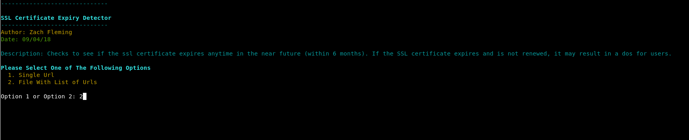

# SSL Certificate Expiring Soon

### Description

Tool to check if a target sites ssl certificate expires anytime within the next 6 months.

### What Is This Important

If the SSL certificate expires and is not renewed, it may result in a dos for users

### Launching the program

To use the program simply open up a terminal navigate to the directory and run it with "./SSL_Certificate_Expiring_Soon.py"

### How To / Program Features

The program has two options. It can either can a single url, or a list of target urls. 
To scan a single url you must include the full url and port number. For example https://www.samplesite.com:443
To scan a text file containg urls, the file must be formatted as follows. Each url must be on a new line and with the following format https://www.samplesite.com:443. 
A sample text file ahs been included also. 

### Screenshots

### Built With

* Python 2.7.14 --> Custom Build Of OpenSSL

### Authors

*** Zach Fleming --> zflemingg1@gmail.com

