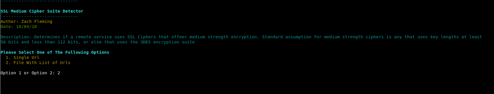
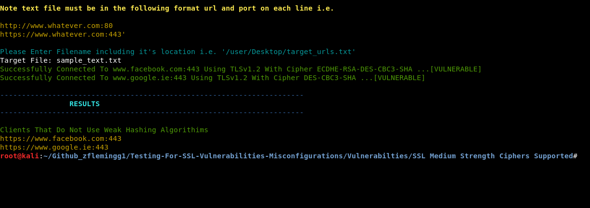

# SSL Medium Strength Ciphers Supported

### Description

Tool to check if a target site supports ssl medium strength cipher suites.

### What Is this important

If a remote service uses SSL Ciphers that offeer medium strength encryption. Standard assumption for medium strength ciphers is any that uses key lengths at least 56 bits and less than 112 bits, or else that uses the 3DES encryption suite. If an attacker is on the same physical network as this service, it is considerably eeasier to bypass medium strength cipher suites

### Launching the program

To use the program simply open up a terminal navigate to the directory and run it with "./ssl_medium_cipher_suites.py"

### How To / Program Features

The program has two options. It can either can a single url, or a list of target urls. 
To scan a single url you must include the full url and port number. For example https://www.samplesite.com:443
To scan a text file containg urls, the file must be formatted as follows. Each url must be on a new line and with the following format https://www.samplesite.com:443. A sample text file ahs been included also. 

The logic behind the porgram is that it will connect to a given url with a vulnerable 64 bit cipher. If the connection is successful then it is assumed that the target is vulnerable. If it is unsuccessful then it is assumed that it's not.

### Screenshots

### Built With

* Python 2.7.14 --> Custom Build Of OpenSSL

### Authors

*** Zach Fleming --> zflemingg1@gmail.com

