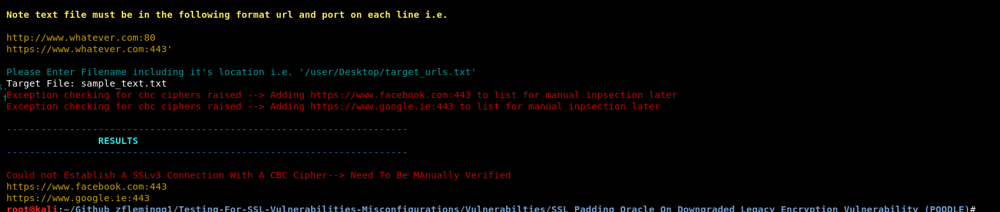

# Padding Oracle On Downgraded Legacy Encryption (POODLE)

### Description

Tool to check if a target site supports ssl ciphers that maybe vulnerable to the POODLE Attack.

### What Is this important

If a remote service uses SSL Ciphers that are vulnerable to the Padding Oracle On Downgraded Legacy Encryption (POODLE) Attack. If it does support an ssl cipher that is vulnerable, it may allow for a man in the middle exploit. This works by attackers taking advantage of clients fallback to SSLv3. If an attacker successfully exploits this vulnerability it make allow them to view encrypted data in plaintext
		

### Launching the program

To use the program simply open up a terminal navigate to the directory and run it with "./ssl_poodle.py"

### How To / Program Features

The program has two options. It can either can a single url, or a list of target urls. 
To scan a single url you must include the full url and port number. For example https://www.samplesite.com:443

To scan a text file containg urls, the file must be formatted as follows. Each url must be on a new line and with the following format https://www.samplesite.com:443. 
A sample text file has been included also. 

### Screenshots

### Built With

* Python 2.7.14 --> Custom Build Of OpenSSL

### Authors

*** Zach Fleming --> zflemingg1@gmail.com

