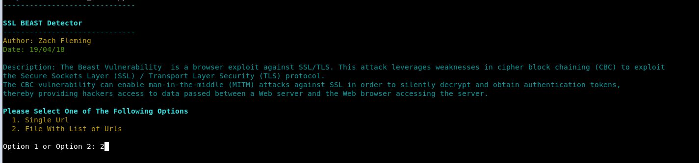
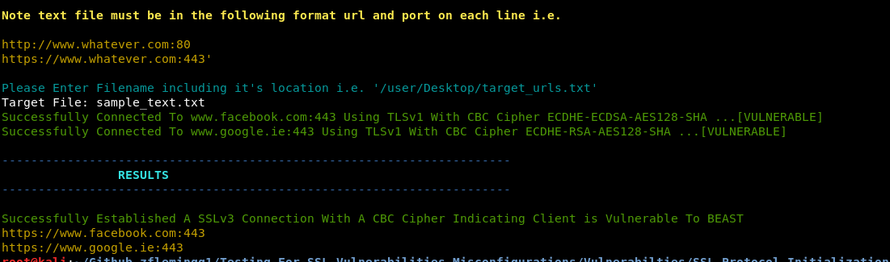

# SSL Protocol Initialization Vector Implementation Information Disclosure Vulnerability (BEAST)

### Description

Tool to check if a target site supports ssl ciphers that maybe vulnerable to the BEAST Attack.

### What Is this important

The Beast Vulnerability  is a browser exploit against SSL/TLS. This attack leverages weaknesses in cipher block chaining (CBC) to exploit the Secure Sockets Layer (SSL) / Transport Layer Security (TLS) protocol.
The CBC vulnerability can enable man-in-the-middle (MITM) attacks against SSL in order to silently decrypt and obtain authentication tokens, 
thereby providing hackers access to data passed between a Web server and the Web browser accessing the server. 

To test for this there are a couple of requirements that need to be met.
TLSv1.0 + CBC = BEAST
		

### Launching the program

To use the program simply open up a terminal navigate to the directory and run it with "./ssl_beast.py"

### How To / Program Features

The program has two options. It can either can a single url, or a list of target urls. 
To scan a single url you must include the full url and port number. For example https://www.samplesite.com:443

To scan a text file containg urls, the file must be formatted as follows. Each url must be on a new line and with the following format https://www.samplesite.com:443. 
A sample text file has been included also. 

### Screenshots

### Built With

* Python 2.7.14 --> Custom Build Of OpenSSL

### Authors

*** Zach Fleming --> zflemingg1@gmail.com

