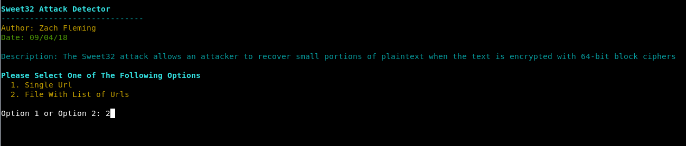
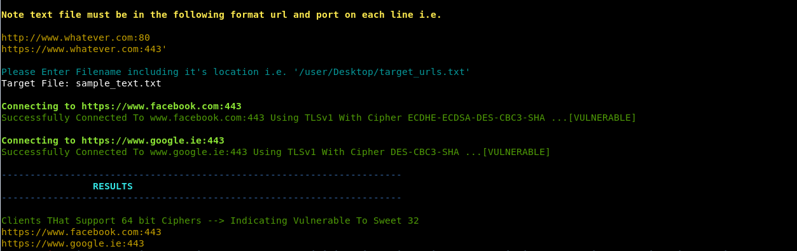

# Zach-Scripts

### Description

Tool to check if a target site handles https cache control effectively or if it is vulnerable to cacheable https attacks.

### What Is A SWEET32 Attack

The Sweet32 attack allows an attacker to recover small portions of plaintext when the text is encrypted with 64-bit block ciphers

### Launching the program

To use the program simply open up a terminal navigate to the directory and run it with "./SSL_64_bit_Block_Size_Cipher_Suites_Supported_SWEET32.py"

### How To / Program Features

The program has two options. It can either can a single url, or a list of target urls. 
To scan a single url you must include the full url and port number. For example https://www.samplesite.com:443
To scan a text file containg urls, the file must be formatted as follows. Each url must be on a new line and with the following format https://www.samplesite.com:443. A sample text file ahs been included also. 

The logic behind the porgram is that it will connect to a given url with a vulnerable 64 bit cipher. If the connection is successful then it is assumed that the target is vulnerable. If it is unsuccessful then it is assumed that it's not.

### Screenshots

### Built With

* Python 2.7.14 --> Custom Build Of OpenSSL

### Authors

*** Zach Fleming --> zflemingg1@gmail.com

