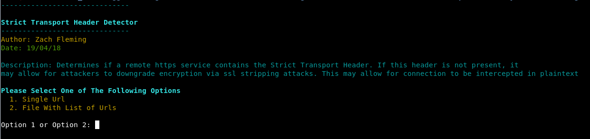
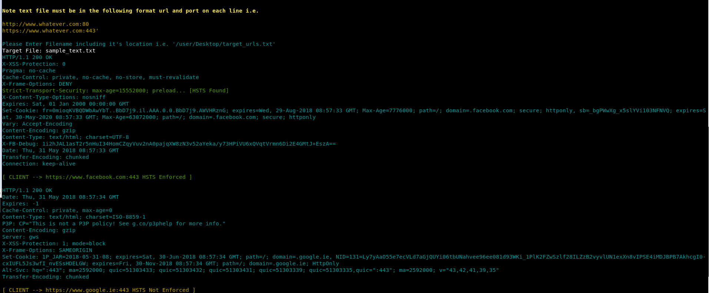

# Strict Transport Header Detector

### Description

Tool to check if a target site supports tl1v1 

### What Is this important

In relation to integrity of encrypted data, it is important to determines if a remote https service contains the Strict Transport Header. If this header is not present, it may allow for attackers to downgrade encryption via ssl stripping attacks. This may allow for connection to be intercepted in plaintext

		

### Launching the program

To use the program simply open up a terminal navigate to the directory and run it with "./sts_missing.py"

### How To / Program Features

The program has two options. It can either can a single url, or a list of target urls. 
To scan a single url you must include the full url and port number. For example https://www.samplesite.com:443

To scan a text file containg urls, the file must be formatted as follows. Each url must be on a new line and with the following format https://www.samplesite.com:443. 
A sample text file has been included also. 

### Screenshots

### Built With

* Python 2.7.14 --> Custom Build Of OpenSSL

### Authors

*** Zach Fleming --> zflemingg1@gmail.com

