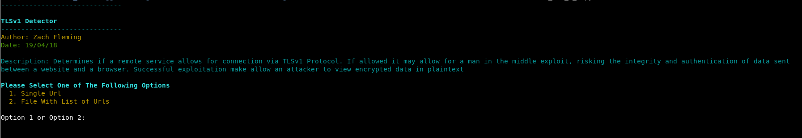

# TLS Version 1.0 Protocol Detection

### Description

Tool to check if a target site supports tl1v1 

### What Is this important

If a remote service allows for connection via TLSv1 Protocol. If allowed it may allow for a man in the middle exploit, risking the integrity and authentication of data sent between a website and a browser. Successful exploitation make allow an attacker to view encrypted data in plaintext

		

### Launching the program

To use the program simply open up a terminal navigate to the directory and run it with "./ssl_tls_1_0.py"

### How To / Program Features

The program has two options. It can either can a single url, or a list of target urls. 
To scan a single url you must include the full url and port number. For example https://www.samplesite.com:443

To scan a text file containg urls, the file must be formatted as follows. Each url must be on a new line and with the following format https://www.samplesite.com:443. 
A sample text file has been included also. 

### Screenshots

### Built With

* Python 2.7.14 --> Custom Build Of OpenSSL

### Authors

*** Zach Fleming --> zflemingg1@gmail.com

